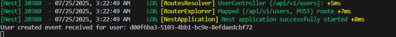

# Clean Architecture NestJS User System

## Description

This project is a technical test implementation showcasing **Clean Architecture** principles with **NestJS**, **TypeScript**, and **Firebase**. It implements a user management system that automatically generates secure passwords when users are created without one.

> 📖 **For detailed architecture documentation and implementation details, see [ARCHITECTURE.md](./ARCHITECTURE.md)**

## Architecture Overview

The project follows Clean Architecture principles with clear separation of concerns:

### 📁 Project Structure

```
src/
├── domain/                     # Domain Layer (Enterprise Business Rules)
│   ├── entities/               # Domain entities
│   │   └── user.entity.ts
│   ├── events/                 # Domain events
│   │   └── user-created.event.ts
│   ├── repositories/           # Repository interfaces
│   │   └── user.repository.interface.ts
│   ├── services/               # Domain service interfaces
│   │   └── password.service.interface.ts
│   ├── repositories/           # Repository interfaces
│   ├── services/               # Service interfaces  
│   ├── events/                 # Domain events
│   └── exceptions/             # Domain exceptions
├── application/                # Application Layer (Use Cases)
│   ├── dtos/                   # Data Transfer Objects
│   │   ├── create-user.dto.ts
│   │   └── create-user-response.dto.ts
│   ├── use-cases/              # Business use cases
│   │   └── create-user.use-case.ts
│   └── di-tokens.ts            # DI tokens (framework constraint)
├── infrastructure/             # Infrastructure Layer (External Concerns)
│   ├── config/                 # Configuration
│   │   └── firebase.config.ts
│   ├── database/               # Database implementations
│   │   └── firebase-user.repository.ts
│   └── services/               # External services
│       └── password.service.ts
└── presentation/               # Presentation Layer (Controllers)
    ├── controllers/
    │   └── user.controller.ts
    └── dtos/
```

### 🏗️ Layer Dependencies

- **Domain Layer**: No dependencies (pure business logic)
- **Application Layer**: Depends only on Domain
- **Infrastructure Layer**: Implements Domain interfaces
- **Presentation Layer**: Depends on Application and Domain

## Features

### ✨ Core Functionality

- **User Creation**: Create users with username, email, and optional password
- **Automatic Password Generation**: Secure password generation when not provided  
- **Event-Driven Architecture**: Events trigger password generation automatically
- **Input Validation**: Request validation at API boundary
- **Security**: Passwords are hashed with bcrypt (12 rounds)

### 🔧 Technical Features

- **Clean Architecture**: Proper separation of concerns
- **Firebase Integration**: Firestore database with emulator support
- **Event System**: NestJS EventEmitter for decoupled communication
- **Validation**: Class-validator for DTO validation
- **Unit Tests**: Comprehensive test coverage
- **TypeScript**: Full type safety

## Prerequisites

- **Node.js** (v16 or higher)
- **npm** or **yarn**
- **Firebase CLI** (for emulators)

## Installation & Setup

### 1. Clone and Install Dependencies

```bash
# Clone the repository
git clone <repository-url>
cd clean-architecture

# Install dependencies
npm install

# Install Firebase CLI globally (if not already installed)
npm install -g firebase-tools
```

### 2. Environment Configuration

Create a `.env` file in the root directory:

```bash
# Copy the example file
cp .env.example .env
```

The `.env` file should contain:

```env
FIREBASE_PROJECT_ID=clean-architecture-test
NODE_ENV=development
FIRESTORE_EMULATOR_HOST=localhost:8080
```

### 3. Firebase Emulator Setup

```bash
# Start Firebase emulators (RECOMMENDED - matches your default env variables)
firebase emulators:start --only firestore --project clean-architecture-test

# Alternative: Use any project name (must match your FIREBASE_PROJECT_ID in .env)
firebase emulators:start --only firestore --project your-project-name

# The emulators will run on:
# - Firestore: http://localhost:8080
# - Firebase UI: http://localhost:4000 (access your data here)
```

> ⚠️ **Important**: The `--project` flag is required to access the Firebase UI. Use the same project name as in your `.env` file.

## Running the Application

### Development Mode

```bash
# Start the application in development mode
npm run start:dev

# The API will be available at http://localhost:3000
```

### Production Mode

```bash
# Build the application
npm run build

# Start in production mode
npm run start:prod
```

## API Endpoints

### Create User

**POST** `/api/v1/users`

**Request Body:**
```json
{
  "username": "johndoe",
  "email": "john@example.com",
  "password": "OptionalPassword123!" // Optional
}
```

**Response:**
```json
{
  "id": "uuid-generated-id",
  "username": "johndoe",
  "email": "john@example.com"
}
```


## Event Flow

When a user is created:

1. **User Creation** → `CreateUserUseCase` validates and saves user
2. **Event Emission** → `UserCreatedEvent` is emitted
3. **Event Handling** → `EventHandlerService` listens for the event
4. **Password Generation** → If no password provided, generates secure password
5. **User Update** → Updates user with hashed password
6. **Database Update** → Saves changes to Firebase

## 📸 Evidence Screenshots

### 1. Firebase Emulator Suite Running

*Firebase Emulator Suite successfully started with Firestore and UI components*

### 2. Firestore Database - User Records

*User collection in Firestore showing stored user documents with all fields including auto-generated passwords*

### 3. API Testing - User Creation WITH Password

*Successful API call creating a user with a provided password, showing complete request/response flow*

### 4. Event Logs - User WITH Password Creation

*NestJS application logs showing event-driven architecture when user provides their own password*

### 5. API Testing - User Creation WITHOUT Password

*Successful API call creating a user without password, demonstrating auto-generation feature*

### 6. Event Logs - Auto Password Generation

*Application logs showing automatic password generation and update process when no password is provided*

## 🎯 What the Evidence Shows

### ✅ **Clean Architecture Implementation**
- Clear separation of concerns across all layers
- Domain-driven event system working correctly
- Proper dependency injection and inversion

### ✅ **Core Functionality**
- ✅ User creation with optional password field
- ✅ Automatic secure password generation when not provided
- ✅ Event-driven architecture triggering password updates
- ✅ Proper data persistence in Firebase Firestore

### ✅ **Technical Requirements**
- ✅ NestJS framework with TypeScript
- ✅ Firebase/Firestore database integration
- ✅ Secure password handling with bcrypt
- ✅ RESTful API endpoints working correctly

### ✅ **Security Features**
- ✅ Password hashing with bcrypt (12 salt rounds)
- ✅ Strong password generation using crypto primitives
- ✅ Input validation at API layer
- ✅ Proper error handling and domain exceptions

## Testing

### Run Unit Tests

```bash
# Run all tests
npm run test

# Run tests in watch mode
npm run test:watch

# Run tests with coverage
npm run test:cov
```

### Test Coverage

The project includes comprehensive unit tests for:

- **Domain Entities**: User entity behavior
- **Domain Events**: User creation and password generation events
- **Password Service**: Generation, hashing, and validation
- **Use Cases**: Business logic testing


## Security Features

### Password Security

- **Automatic Generation**: Secure passwords when not provided
- **Strength Validation**: Enforces strong password requirements
- **Hashing**: bcrypt with 12 salt rounds
- **Character Requirements**: Uppercase, lowercase, numbers, special characters

### Validation

- **Request Validation**: Email format and username requirements at API layer
- **Framework Integration**: NestJS with TypeScript and Firebase
- **Password Strength**: Minimum 8 characters with complexity requirements

## Development Guidelines

### Adding New Features

1. **Start with Domain**: Define entities, value objects, events
2. **Create Use Cases**: Implement business logic in application layer
3. **Add Infrastructure**: Implement repositories and external services
4. **Create Controllers**: Add REST endpoints in presentation layer
5. **Write Tests**: Ensure comprehensive test coverage

### Code Quality

```bash
# Lint code
npm run lint

# Format code
npm run format

# Type checking
npm run build
```

## Deployment

### Firebase Production Setup

1. Create a Firebase project
2. Generate service account key
3. Set production environment variables
4. Deploy to your preferred hosting platform

### Environment Variables for Production

```env
FIREBASE_PROJECT_ID=your-production-project-id
NODE_ENV=production
GOOGLE_APPLICATION_CREDENTIALS=path/to/service-account-key.json
```

## Troubleshooting

### Common Issues

1. **Firebase Emulator Not Starting**
   ```bash
   # Kill any existing processes
   npx kill-port 8080
   npx kill-port 4000
   
   # Restart emulators with correct project
   firebase emulators:start --only firestore --project clean-architecture-test
   ```

2. **Module Resolution Issues**
   ```bash
   # Clear node_modules and reinstall
   rm -rf node_modules package-lock.json
   npm install
   ```

3. **TypeScript Errors**
   ```bash
   # Check TypeScript configuration
   npm run build
   ```

## Architecture Benefits

### 🎯 Clean Architecture Advantages

- **Independence**: Business logic independent of frameworks
- **Testability**: Easy to unit test business rules
- **Flexibility**: Easy to change infrastructure without affecting business logic
- **Maintainability**: Clear separation of concerns

### 🔄 Event-Driven Benefits

- **Decoupling**: Components communicate through events
- **Extensibility**: Easy to add new event handlers
- **Auditability**: Clear event trail for debugging

## 📝 Implementation Notes

### Architecture Flexibility
This Clean Architecture implementation prioritizes **Dependency Rule compliance** over specific folder organization. Different structural approaches exist, but the core principle—outer layers depending on inner layers—remains constant.

### Business Rules
Password generation and validation rules are implemented for demonstration purposes. In production, these would be defined by business requirements and security policies.

### System Enhancements
For production systems, consider adding:
- **Audit fields** (`createdAt`, `updatedAt`, `createdBy`) for data tracking
- **Logging and monitoring** for operational visibility

## Contributing

1. Follow the established architecture patterns
2. Write comprehensive tests for new features
3. Maintain clean separation between layers
4. Document any new environment variables or setup steps

## License

This project is licensed under the MIT License.
